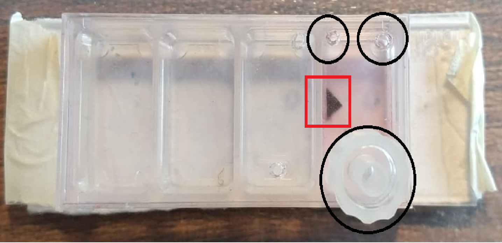
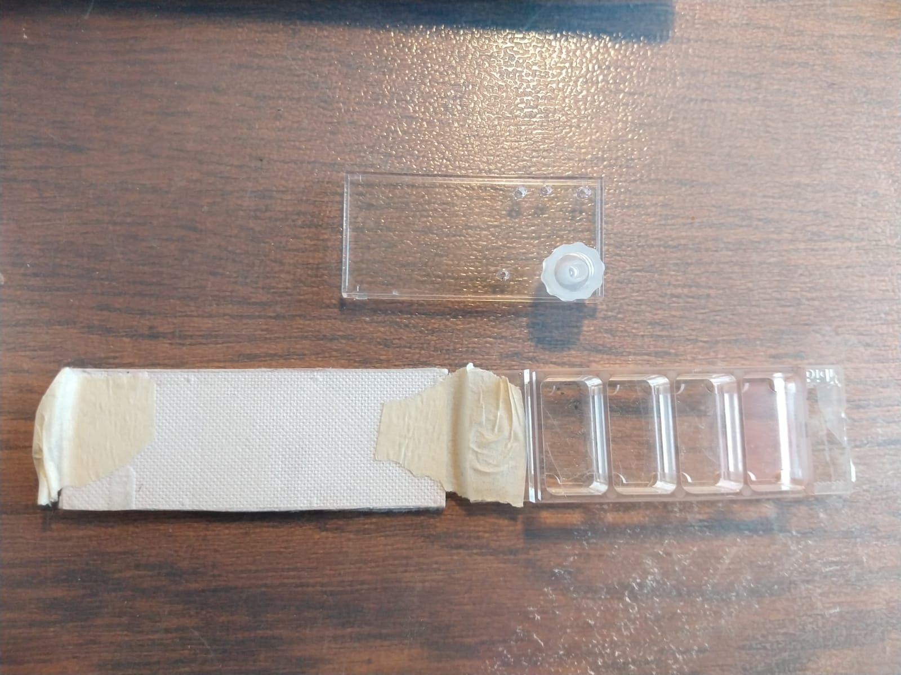

# Project LabmAIte - RL Module

## Example Usage

### Hardware Setup
#### Overview

1. Computer with installed software.
2. 2 Adox pumps with syringes and corresponding tubings + food colorant (red, blue)
3. USB Microscope
4. [IBIDI Chip](https://ibidi.com/chambered-coverslips/38--slide-4-well-ph.html) 
5. Peristaltic pump for draining excess liquid with adapter
6. Sufficient USB ports or USB hub

#### Chip Layout

<br><br>
The top cover of the chip must be drilled in order to insert the tubing (with its corresponding metal point) for both inlets (syringes, top circles) and outlet (draining pump, lower circle). <br>
The adapter placed on the outlet is optional as it is only used for fixing the outlet's needle position. <br>
To focus the camera always in the same spot we drew an arrow with black permanent marker on the back part of the chip (marked in red). The microscope should be positioned such that the center of the image is between the arrow and the inlets.<br>  
To enhance color intensity, an even white cardboard is attached as background to the transparent chip as shown below.


### Software Setup

To run the experiment a few things have to be determined first: <br>
1. The opencv camera index of the attached camera. (This is usually 0 if no webcam is present and 1 if a webcam is installed)
2. The mapping between serial ports and attached pump (and its contained color). 

To determine these parameters, the `rl/demonstrations/setup_checks.py` file exists.<br>
Once it is executed it first prints the available camera indices to the console.<br> 
Afterwards it cycles through the available serial devices, activates them one after another for 3 seconds and prints their current port.<br>
To ensure a proper mapping, the port of the pump together with the fluid in the pump's syringe should be noted. <br>
The port usually goes with names like `/dev/ttyUSB*` for unix based platforms and `COM*` for the windows platform. <br><br>
To supply the correct ports to the system the environments pump mappings have to be adapted. This is done in the `rl/envs/gym_envs/env_config_colormix_real.json` file.
The file contains two mappings, `red` and `blue`. In the configuration file the value under the `port` key has to be changed such that the ports match the color in the corresponding pump, i.e. if the pump at port `COM1` contains blue fluid but the configuration file has port `COM2` in the blue mapping, this value has to be changed to `COM1`.<br>
Additionally, the configuration has `flush_port` property, which determines the pump to use for flushing the device after one episode of execution (100 time-steps). This value of this property should be the port of the pump containing the blue fluid.<br>    
As a last step, the `camera_index` property has to be changed to the camera index of the microscope (as mentioned above, i.e. if the `setup_checks.py` shows more than one camera index, the microscope index is likely to be the last one, otherwise just use 0).


### Training and Deploying the Example Agent
The `rl` module contains the example folder which provides the necessary code to train and deploy a previously determined configuration in the simulator and the real experiment
#### Training
The `learn.py` file provides a ready to use setup for training an rl agent on the two-fluid color-mix task.<br>
It uses the simulation to train the agent quickly. Afterward, the trained agent can either be deployed to the simulation or the real world experiment by executing the corresponding file.
Executing the `learn.py` also creates multiple evaluation results of the trained agent to verify the successful training.<br>
The `overview.png` file created inside the agent's training folder shows all of the metrics measured during and after training. 
The Mean Training Reward indicates the agent's learning progress of the course of the training. Agents attempt to maximize their reward per episode which in this case is the negative distance between desired and actual red channel state.<br> 
A mean reward close to zero indicates that the agent was able to successfully adjust the red channel value to the desired value. A stagnating mean training reward close to zero implies that the agent has successfully learned to adjust the value over different desired goal values (since the goal value changes every episode) and therefore training is complete.<br>  
SPAG (Success Percentage After Goal) is a custom metric defined in this work which measures the accuracy of the agent after it has reached the desired goal value for the first time. The metric measures the percentage of successful steps after the goal has been reached for the first time. A successful step is considered to be an action which leads to a color value <= 1.5 from the goal value.
An SPAG of 1 therefore shows that the agent is able to maintain the desired color value throughout the episode after it has reached the value for the first time. <br>
SPAG is reported for both, training episodes and validation episodes. Validation of the agent is performed every 20 episodes and training is paused for a short duration. <br>
During validation the agent is supposed to reach 8 different goal states starting from a fixed initial state. These 8 goal states span across the whole goal space (i.e. from 100 to 200) and therefore validation estimates the performance of the agent across the whole goal space.
 
#### Viewing the Agent Inside the Simulation
Before deploying the agent to the real experiment it is helpful to view the agent's behaviour in the simulation. The `play_agent.py` in the `example` folder uses the trained agent from `learn.py` to run a few episodes inside the simulation and display the behaviour of the agent to the user. <br>


#### Deploying the Agent to the Real Experiment
The `run_real_experiment.py` attempts to run the agent trained in `learn.py` in a real experiment setup. The proper configuration of the experiment setup as described above and shown in the pictures should be validated before running the agent.<br>
To ensure best performance of the agent it is important to properly configure the base illumination of the device. The previous experiments adjusted the light intensity such that the mean RGB values for an image of the chip filled with water are roughly 180.<br>
Following experiments should configure the system accordingly to allow reproducible results. Also the task of mixing colors is currently defined between the intensity range of 100 and 200. <br>
The agent will therefore never receive a goal outside of these boundaries.
#### Color-Mix Task Description and Expected Behaviour
When running the agent inside the real experiment, the following behaviour should be visible:
1. At the beginning of each episode the controller will flush the device with the specified flush port for a random time duration between 0 and 8 seconds with maximum infusion rate. Although not required when evaluating the agent, this behaviour provides a way to alter the chip state between episodes.
2. Once an episode started, the agent will operate in so-called cycles. A cycle consists of infusion time and idle time to allow the color mixture to settle. Currently the cycle is set to 3 seconds infusion and 3 seconds idle (i.e. total cycle time 6 seconds).<br>
After a cycle finished the microscope will capture the current RGB value measured by the microscope and pass it to the agent which will then decide for the action to take place in the next cycle (which is started after decision is made).
The agent has two decide between the two colored fluids and 8 different discrete infusion levels (0-300ul/min) per pump, i.e. there are 16 different actions to choose from in this experiment setup. Only one action can be executed per cycle.
3. An episode has a total duration of 100 cycles (i.e. 600 seconds), after an episode is finished, the chip is flushed randomly again and a new goal is sampled from the goal space.   

## Diving Deeper
This section attempts to explain the underlying simulation and RL mechanics in more detail. It is work in progress and therefore far from complete.
To get started with RL theory I recommend the [lecture](http://www0.cs.ucl.ac.uk/staff/d.silver/web/Teaching.html) by David Silver and the [Reinforcement Learning](http://incompleteideas.net/book/bookdraft2017nov5.pdf) Book by Sutton and Barto.

### Understanding the RL Environment Structure
To get familiar with the architecture I recommend you to check out the tutorials of the OpenAI-Gym pages: https://gym.openai.com/docs/.<br>
OpenAI Gym is the essential protocol with which the RL community works and the RL agents interact with.<br>
It is basically wrapping the architecture described in RL theory in a "Environment" class.<br>
An environment has a `reset()`, `step()` and `render()` method which wrap and encapsulate the whole logic of the task to solve from the RL agent. 
`render()` is just for viewing the environment state and to visualize the agents interaction.
The `step(action_id)` method is the method with which the agent is interacting with the environment. <br>
The method returns a tuple consisting of the observation or state of the environment, the received reward which the environment assigned to the action taken by calling `step(action)` and an indicator if the environment is in a terminal state and needs a call to the `reset()` method.
`reset()` is just for initializing the environment to a new, commonly random state. It returns the initial observation/state of the environment from which the agent then can start interacting with the environment.<br>
The interaction loop of an RL agent with an environment is therefore pretty straightforward structured like this:
```
# create the agent to play (pseudocode)
agent = make_agent()
# create the environment to run
environment = gym.make('the-environment-id-to-play')

for episode in total_episodes_to_play:
    # initialize the environment
    state = environment.reset()
    # indicates whether the environment is in a terminal state (never happens upon reset)
    done = False
    
    while not done:
        # pass the state of the env to the agent, it will decide / return the ->index<- of the action to take
        action_idx = agent.select_action(state)
        
        # execute the agent's desired action
        new_state, reward, done, debug = environment.step(action_idx)
        
        # display the state of the environment
        environment.render(mode="human")

        # do some additional processing here if needed
        ...
        
        # override the old state with the new state received from the environment
        state = new_state
        
        # repeat until done flag is True
```
This is the basic interaction loop for executing a trained agent in any gym environment (the training loop has a little bit more code but we are training using the stable_baslines library and therefore don't have to worry about that)


### ColorMix environment
The simulation follows this pattern of having a `step()` function and is also later wrapping in a custom Gym-Environment to ease the use of it.
The simulation core is in the utils package under `fluids/envs/fluid_env_v2.py`. The `FluidEnvBaseV2` class is basically the same as the Gym Environment class but requires additional parameters for initialization. 
There are a couple of different classes required and used for the simulation which will be explained in more detail in a future extended documentation.
If you are interested in getting deeper into the code, most of the logic can be found in the `MfdState` (which represents a "virtual" micro-fluidic device) class in the `simulation_devices.py` file as well as the `Inlet` and `ClippingOutlet` class in the `device_components.py` file.
